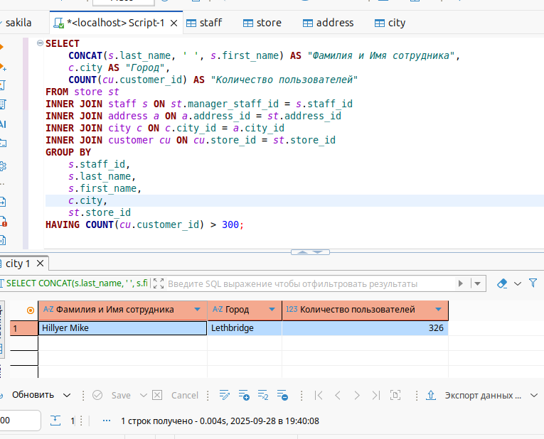
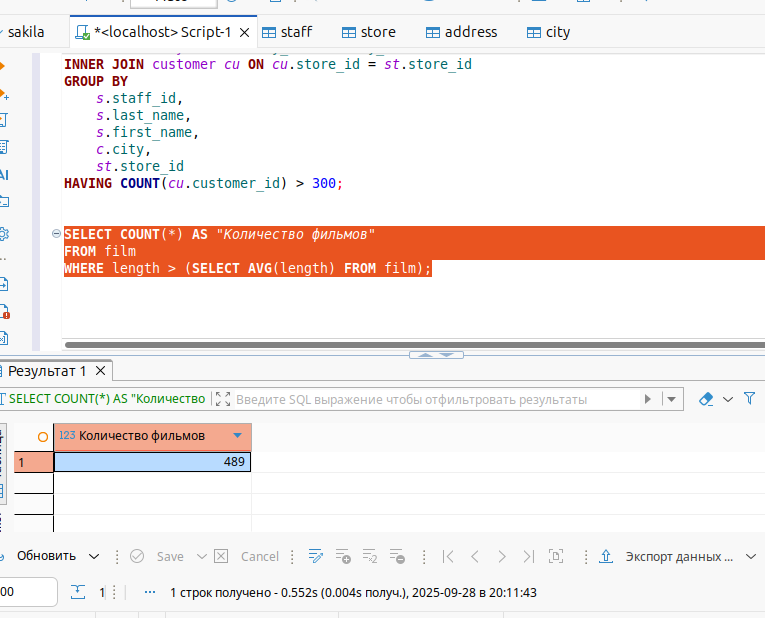
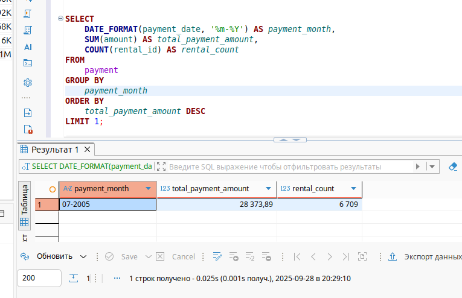
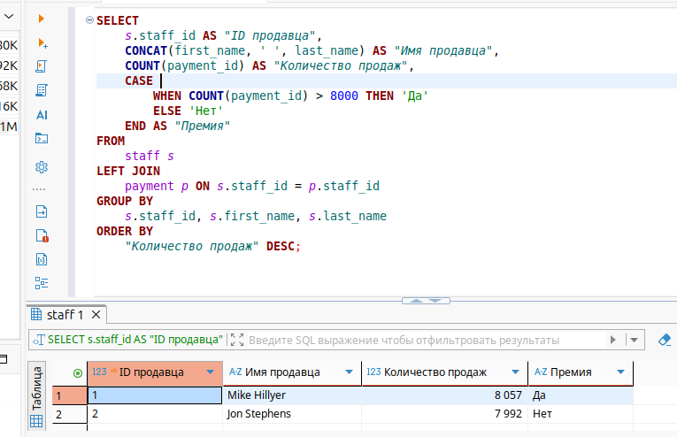
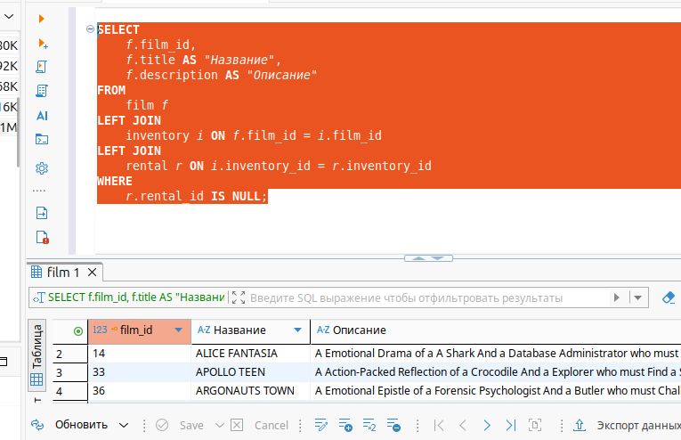

# Домашнее задание к занятию «SQL. Часть 1» Шелухин Юрий

### Задание 1.

Одним запросом получите информацию о магазине, в котором обслуживается более 300 покупателей, и выведите в результат следующую информацию: 
- фамилия и имя сотрудника из этого магазина;
- город нахождения магазина;
- количество пользователей, закреплённых в этом магазине.
 
---

#### Решение 1.

1.1. Запустим MYSQL в контейнере Docker-compose.

`docker-compose up -d`

1.2. Выполним запрос по условию задания.

`SELECT 
    CONCAT(s.last_name, ' ', s.first_name) AS "Фамилия и Имя сотрудника",
    c.city AS "Город",
    COUNT(cu.customer_id) AS "Количество пользователей"
FROM store st
INNER JOIN staff s ON st.manager_staff_id = s.staff_id
INNER JOIN address a ON a.address_id = st.address_id
INNER JOIN city c ON c.city_id = a.city_id
INNER JOIN customer cu ON cu.store_id = st.store_id
GROUP BY 
    s.staff_id, 
    s.last_name, 
    s.first_name, 
    c.city,
    st.store_id
HAVING COUNT(cu.customer_id) > 300;` 

---
 

### Задание 2.

Получите количество фильмов, продолжительность которых больше средней продолжительности всех фильмов..

---

#### Решение 2.

Выполним запрос для по условию задания.

`SELECT payment_date AS 'дата платежа',
		amount AS 'стоимость'
FROM payment
WHERE payment_date BETWEEN '2005-06-15 00:00:00' AND '2005-06-18 23:59:59'
	AND amount > 10.00
ORDER BY payment_date;` 

---

### Задание 3.

Получите информацию, за какой месяц была получена наибольшая сумма платежей, и добавьте информацию по количеству аренд за этот месяц.

---

#### Решение 3.

Выполним запрос для по условию задания.

`SELECT rental_date AS 'дата аренды'
FROM rental
ORDER BY rental_date DESC
LIMIT 5;`

---

### Задание 4*.

Посчитайте количество продаж, выполненных каждым продавцом. Добавьте вычисляемую колонку «Премия». Если количество продаж превышает 8000, то значение в колонке будет «Да», иначе должно быть значение «Нет»
  
---

#### Решение 4.

Выполним запрос для по условию задания.

`SELECT
	REPLACE(LOWER(first_name), 'll', 'pp') AS 'Имя',
	REPLACE(LOWER(last_name), 'll', 'pp') AS 'Фамилия',
	email AS 'Электронная почта'		
FROM customer
WHERE first_name = 'Kelly' OR first_name = 'Willie'
ORDER BY last_name;`

---

### Задание 5*.

Найдите фильмы, которые ни разу не брали в аренду..

#### Решение.

Выполним запрос для по условию задания.

`SELECT
	LEFT(email, POSITION('@' IN email) - 1) AS 'Имя пользователя',
    RIGHT(email, LENGTH(email) - POSITION('@' IN email)) AS 'Домен',
	email AS 'Электронная почта'		
FROM customer
WHERE POSITION('@' IN email) > 0
ORDER BY email;`

---

